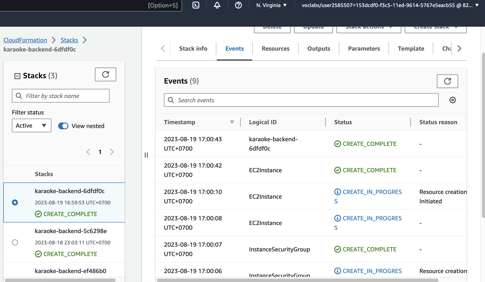
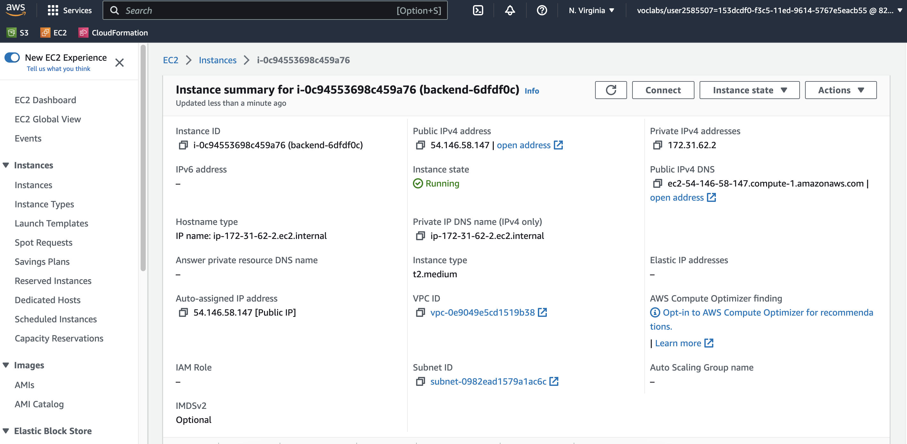
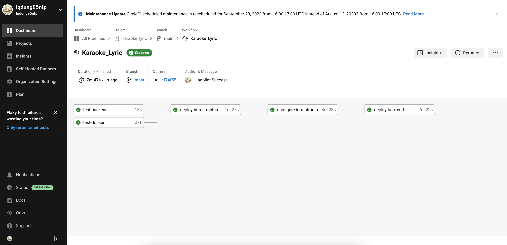
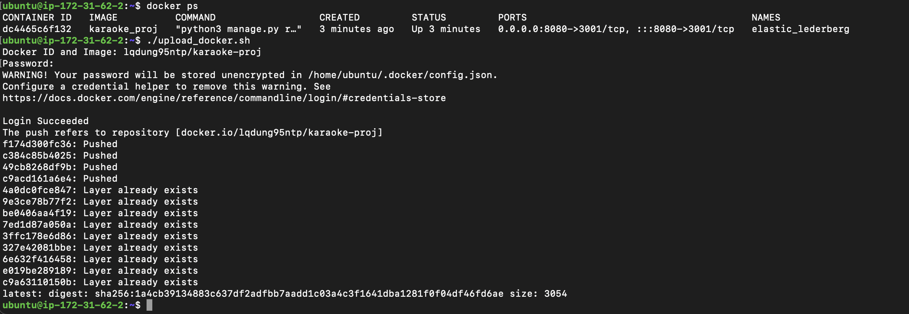
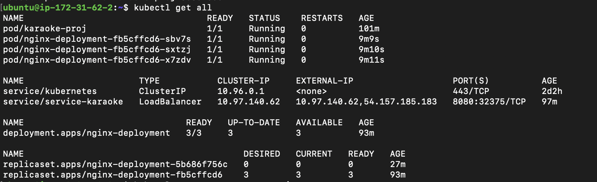
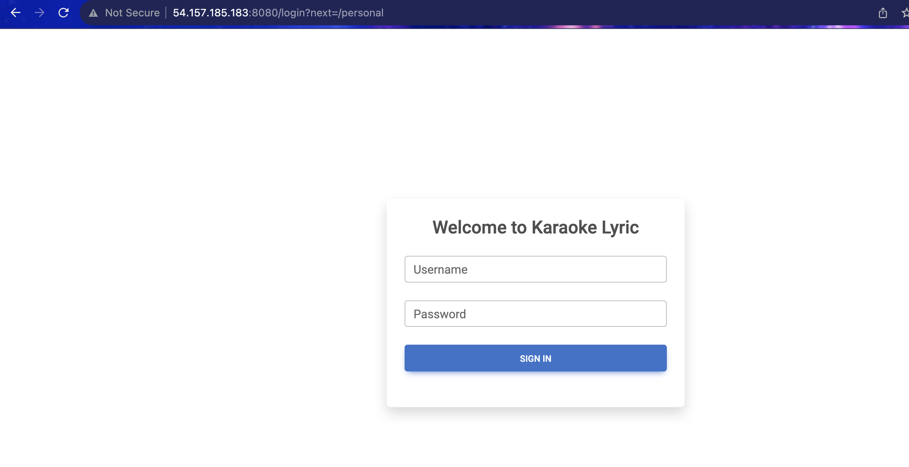
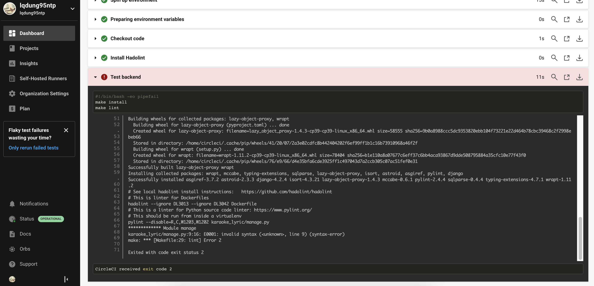
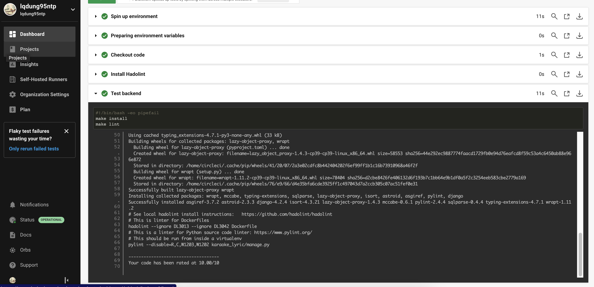

# karaoke_lyric Project
https://github.com/lqdung95ntp/karaoke_lyric

Final Udacity Project

1. Idea of CICD pipeline
- Karaoke_lyric project will be pushed to github
- CircleCi will fetch the latest commit:
    + Build IaaS on AWS using Cloudformation

    + Instance EC2 is created:

    + Build CircleCI pipeline

    + Push the docker image to the repository

    + Deploy app using Kubernetes:

    + Access webapp using public link: http://54.146.58.147:8080/login?next=/personal

2. Test pipeline
- Lint fail test

- Lint pass test
